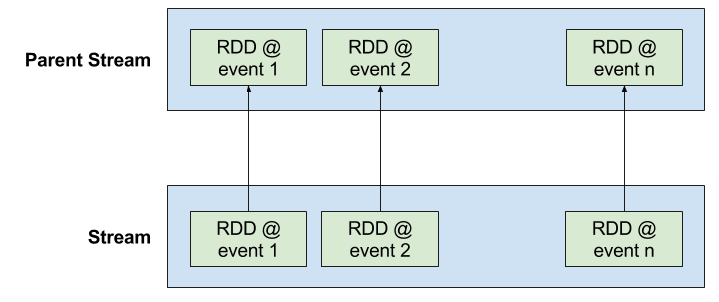
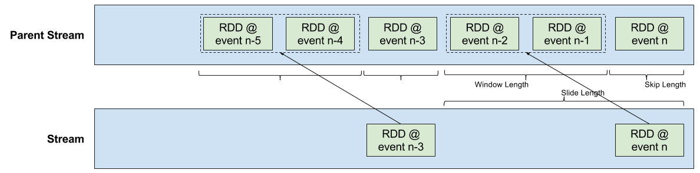
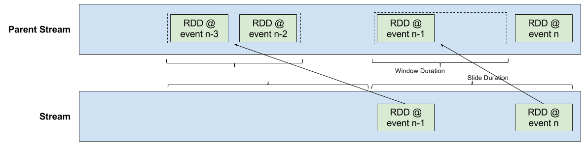
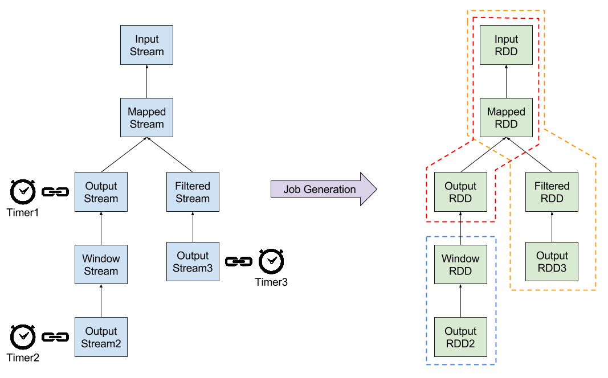
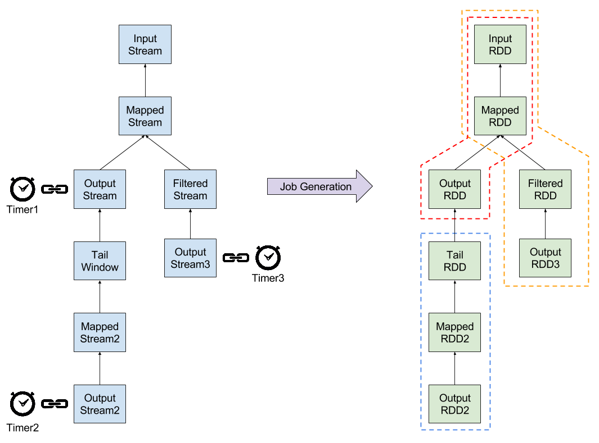

Table of contents
=================
* [Overview](#overview)
* [Quick Example](#quick-example)
* [Basic Concepts](#basic-concepts)
  * [Event](#event)
  * [Event Source](#event-source)
    * [Operations on Event Sources](#operations-on-event-sources)
    * [Custom Event Sources](#custom-event-sources)
  * [Dependency](#dependency)
    * [Event Dependency](#event-dependency)
    * [Tail Dependency](#tail-dependency)
    * [Time Window Dependency](#time-window-dependency)
  * [Bind Logic](#bind-logic)
    * [Cascaded Jobs](#cascaded-jobs)
      * [Dependency Operations](#dependency-operations)
    * [Default Timer](#default-timer)
  * [DStream Checkpoint Interval](#dstream-checkpoint-interval)

<a name="overview"/>
#Overview

The streaming API of Apache Spark assumes an equi-frequent micro-batches model such that streaming data are allocated and jobs are submitted into a batch every fixed amount of time (aka `batchDuration`). Reactive Spark API is an extension of this model; instead of generating a batch every `batchDuration`, batch generation becomes event based; Spark listens to event sources and generates batches upon events. The equi-frequent micro-batches becomes equivalent to a timer event source that fires a timer event every `batchDuration`.

This allows a fine grain scheduling of Spark jobs. The same code could run as either streaming or batching. With this model, a batch job could easily be configured to run periodically. There would be no need to deploy or configure an external scheduler (like Apache Oozie or linux crons). This model easily allows jobs with dependencies that span across time, like daily logs transformations concluded by weekly aggregations.

<a name="quick-example"/>
#Quick Example

Before digging deeper into the details of the reactive API, let's take a look at some quick examples and see how the reactive API looks like in general.

The following example is about recurrent batch jobs that do some processing on log files.

```scala
val conf = new SparkConf().setMaster("local[*]").setAppName("ReactiveSpark")
val ssc = new StreamingContext(conf, Seconds(1))

// dailyTimerStartTime, dailyTimerEndTime, weeklyTimerStartTime
// and weeklyTimerEndTime are defined somewhere else
val dailyTimer = ssc.timer(dailyTimerStartTime, dailyTimerEndTime, Days(1), "DailyTimer")
val weeklyTimer = ssc.timer(weeklyTimerStartTime, weeklyTimerEndTime, Days(7), "WeeklyTimer")

val logs: DStream[String] = ssc.textFileStream("logs")

logs.filter(line => line.contains("WARN") || line.contains("ERROR"))
  .saveAsTextFiles("daily-logs")
  .bind(dailyTimer)
  .tailWindow(windowLength = 7, slideLength = 7, skipLength = 0)
  .filter(line => line.contains("ERROR"))
  .saveAsTextFiles("weekly-logs")
  .bind(weeklyTimer)

ssc.start()
ssc.awaitTermination()
```

First, there is a job that runs on daily basis that reads raw log files and filters log entries with levels `WARN` and `ERROR` saving the filtered output to disk.

```scala
logs.filter(line => line.contains("WARN") || line.contains("ERROR"))
  .saveAsTextFiles("daily-logs")
  .bind(dailyTimer)
```

Then, another job runs on weekly basis, taking the output of the daily job of the last 7 days, filtering log entries with level `ERROR` and saving the output to different path on disk.

```scala
  .tailWindow(windowLength = 7, slideLength = 7, skipLength = 0)
  .filter(line => line.contains("ERROR"))
  .saveAsTextFiles("weekly-logs")
  .bind(weeklyTimer)
```

Note that we have created two event sources, timers: `dailyTimer` that fires every duration of `Days(1)` or one day and `weeklyTimer` that fires every duration of `Days(7)` or one week.

```scala
val dailyTimer = ssc.timer(dailyTimerStartTime, dailyTimerEndTime, Days(1), "DailyTimer")
val weeklyTimer = ssc.timer(weeklyTimerStartTime, weeklyTimerEndTime, Days(7), "WeeklyTimer")
```

To tell Spark what job to execute on what events, we used the method `bind`. Whenever a timer event fires, Spark generates a job for the sequence of transformations before the `bind` and upwards. In order for the weekly job to execute, we need to define the dependency between the daily job and the weekly job and we have done that using the method `tailWindow`. Here, `tailWindow` tells Spark that the weekly job depends on the last 7 outputs from the daily job.

<a name="basic-concepts"/>
#Basic Concepts
<a name="event"/>
##Event
A batch of jobs is generated per event. Each event has:

1. **instanceId:** a universal unique id per context
2. **index:** the index of the event with respect to events from the same event source
2. **time:** a timestamp denoting the time when the event was fired
3. **source:** the source of the event 

Events are ordered naturally with their time however they could also be ordered locally by their index and globally by their instance id. For two events `e1` and `e2` from the same event source, `e1.index` is less than `e2.index` if and only if `e1` has happened before `e2`. For any two events `e1` and `e2`, `e1.instanceId` is less than `e2.instanceId` if and only if `e1` has happened before `e2`.

<a name="event-source"/>
##Event Source
Events are fired by event sources either on regular or irregular basis. Events are for job scheduling purposes and they are not meant to be like the streaming data itself. Events have a respectively lower rate than the streaming data and are fired by a single instance from the event source. Example event sources:

 1. **Timer:** a timer has start and end times, and fires timer events periodically
 2. **File system watcher:** a file system watcher monitors the file system and fires events on file system changes (like the creation of a new file or renaming an existing file ...)
 3. **RESTful web server:** helps triggering a job from an online admin console

Event sources provide listener interfaces so that other parties could get notified for events.

```scala
timer.addListener(new EventListener {
  override def onEvent(event: Event): Unit = {
    println(s"An event has occurred: $event")
  }
})
```

<a name="operations-on-event-sources"/>
###Operations on Event Sources
Events could get complex hence the Reactive API provides a set of functional operations that could be performed on event sources to handle more complex scenarios. Operations like `map`, `filter`, `delay`, `join` ... etc. [TBD] 

<a name="custom-event-sources"/>
###Custom Event Sources
It is possible to implement custom event sources. Custom event sources must extend the abstract class `EventSource` and override the following five methods:

```scala
def start()
def restart()
def stop()
def between(from: Time, to: Time): Seq[Event] = Seq.empty
def toProduct: Product
```

The `start` method is called once when the streaming context is started. It should contain the logic that initializes and starts the event source. The `restart` method is called once instead of `start` when the streaming context is restarted from a checkpoint. It might contain the same code as `start` however it should consider, for example, setting events index counter to a suitable starting point. The `stop` method is called once when the streaming context is stopped. The `toProduct` method is used to convert the event source to a tuple that contains the mandatory parameters that distinguish instances from this event source. For example, the `TimerEventSource` returns the tuple `(startTime, endTime, period, name)`. The optional method `between` is used to generate events in bulk that fall within a time period `[from, to]` inclusively. This is useful for recovering from failures if the streaming context had some down time.

The custom event source must generate events in a different thread than the thread of the caller of the `start` method. When an event occurs, the events generator thread must call the `post` method of the event source in order to notify the listeners with the new event.

Since the custom event source has its own kind of events, new event types must be implemented by extending the abstract class `Event`. The following basic attributes should be set: *eventSource*, *index* and , optionally, *time*.

<a name="dependency"/>
##Dependency
In a sequence of transformations, a dependency defines what RDDs to generate (or pass) from the parent stream to the dependent stream given an event.

<a name="event-dependency"/>
###Event Dependency
A stream directly asks the parent stream for the RDD corresponding to the given event.



<a name="tail-dependency"/>
###Tail Dependency
A stream depends on a window of RDDs from the parent stream. The boundaries of the window are computed by counting events occurred just at and before the given event. There are three parameters that determine the window boundaries:

 - *skip length:* determines how many RDDs to skip corresponding to events just at and before the given event
 - *window length:* determines how many RDDs to include in the window corresponding to events just before the skipped events
 - *slide length:* determines the number of events after which the window is computed



It worth noting that, for the same parameters, windows could have different length in terms of time however the same length in terms of number of events. That could happen when events fire at irregular basis.

Also, a *tail dependency* with *skip length = 0*, *window length = 1* and *slide length = 1* is different than an *event dependency*. The *tail dependency* passes the RDD generated on the last event that had occurred before or at the same time as the given event however the *event dependency* passes the RDD generated at the given event itself. In case the parent stream has no RDDs generated at the given event, *event dependency* passes no RDDs however *tail dependency* does.

<a name="time-window-dependency"/>
###Time Window Dependency
A stream depends on a time window of RDDs from the parent stream. There is an incurred latency before a window is fired as a window is triggered upon the arrival of the first event after its end boundary. The window is defined by two parameters:

 - *window duration:* the length of the window in time units
 - *slide duration:* determines how much at least subsequent windows are apart in time



It worth noting that, for the same parameters, windows could have different length in terms of number of events however the same length in terms of time duration. That happens in case events fire at irregular basis. Also, two subsequent windows could be more than one slide duration apart in time. That might happen when events fire with a lower rate than the window slide rate.

<a name="bind-logic"/>
##Bind Logic
Event sources are connected to streams via the `bind` operator. For any sequence of operations, the event source is bound to only the stream on which `bind` is called.

When an event is fired, a job is generated for each stream that is bound to the corresponding event source regardless from the type of the operation that is bound to the event source, whether it is a lazy transformation or an output operation. In case it is a lazy transformation (like a `map`), an empty job is generated causing the underlying RDDs to be materialized.

Events start on the streams bound to their event sources and propagate upwards the sequence of stream transformations generating the corresponding sequence of RDDs transformations. A stream reacts to an event if the stream is bound to the corresponding event source or it is not bound to any event source at all. Otherwise, event propagation stops. Unless a suitable dependency is defined, no jobs are generated for that specific sequence of stream transformations.

A job contains a sequence of transformations ending at a stream bound to an event source and starting from either the first input stream or from the last stream bound to an event source.



<a name="cascaded-jobs"/>
###Cascaded Jobs
In order to cascade a sequence of jobs that are bound to different event sources, a suitable dependency between any two cascaded jobs should be defined. In the following figure, the `Mapped Stream2` defines an *event dependency* on the `Output Stream`. When `Timer2` fires an event, it propagates upwards the dependencies. When the `Mapped Stream2` asks the `Output Stream` for RDDs through the *event dependency*, the `Output Stream` finds that it is not bound to `Timer2` and ignores the event, hence it passes no RDD, hence no job is generated.


In order to correct this situation, a suitable dependency should be defined at the jobs boundaries. A suitable dependency could be a *tail dependency* with *skip length = 0*, *window length = 1 and slide length = 1*. In that case, the added `Tail Window Stream` would ask the parent `Output Stream` through a *tail dependency* for the RDD that had been generated at event that had occurred on the same time as or before the given event of `Timer2`. If there is any, a job would be generated.



<a name="dependency-operations"/>
####Dependency Operations
The following table summarizes the operations used to set the dependency among stream transformations.

Operation | Meaning
----------|---------
**tailWindow**(*windowLength, slideLength, skipLength*) | Return a new DStream in which each RDD contains all the elements seen in a sliding window of events over this DStream. For example, a window with *windowLength* = 4, *slideLength* = 3 and *skipLength* = 2, will start a new window every 3 events skipping RDDs of the latest 2 events and adding RDDs of the former 4 events directly before the skipped 2 events. *windowLength* is the width of the window as the number of subsequent events to contain in the window. *slideLength* is the sliding length of the window (i.e., the number of events after which the new DStream will generate RDDs). *skipLength* is the skip length of the window as the number of the latest subsequent events to skip and not to add to the window.
**timeWindow**(*windowDuration*) | Return a new DStream in which each RDD contains all the elements seen in a sliding window of time over this DStream. A window is generated at the arrival of the first event after the end boundary. Hence, a latency is incurred waiting for the first event after the end boundary. The sliding duration is equal to the window duration. *windowDuration* is the width of the window.
**timeWindow**(*windowDuration, slideDuration*) | Return a new DStream in which each RDD contains all the elements seen in a sliding window of time over this DStream. A window is generated at the arrival of the first event after the end boundary. Hence, a latency is incurred waiting for the first event after the end boundary. *windowDuration* is the width of the window. *slideDuration* is the sliding interval of the window (i.e., the interval after which the new DStream will generate RDDs).

<a name="default-timer"/>
###Default Timer
If an output operation is not bound to any event source, Spark binds it to a default timer event source when the streaming context is started. The default timer starts immediately when the context starts and has an infinite end time. The default timer has a period that equals the `batchDuration` with which the streaming context is configured. This is to stay compatible with the legacy Spark streaming API.

<a name="dstream-checkpoint-interval"/>
##DStream Checkpoint Interval
A stream could be set to checkpoint data every now and then. The checkpoint interval could be set in two ways:

- *duration:* `dstream.checkpoint(checkpointDuration)` sets the stream to checkpoint after at least `checkpointDuration` has passed since the last checkpoint
- *count:* `dstream.checkpoint(checkpointCount)` sets the stream to checkpoint after at least a number of events equal to `checkpointCount` has occurred since the last checkpoint

In case both `checkpointCount` and `checkpointDuration` are set, both events duration and count are considered and a checkpoint happens whenever any criterion is satisfied.